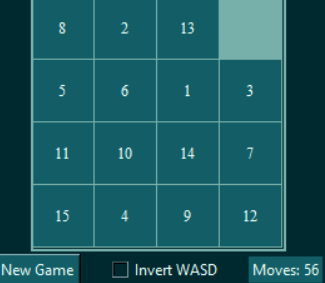

Sliding number puzzle with a dynamic amount of rows and columns\
with click to solve as well as wasd functionality\
2 modes of using wasd 
- use it to control blocks around blank space
- use it to control blank space(default reccomended)\

